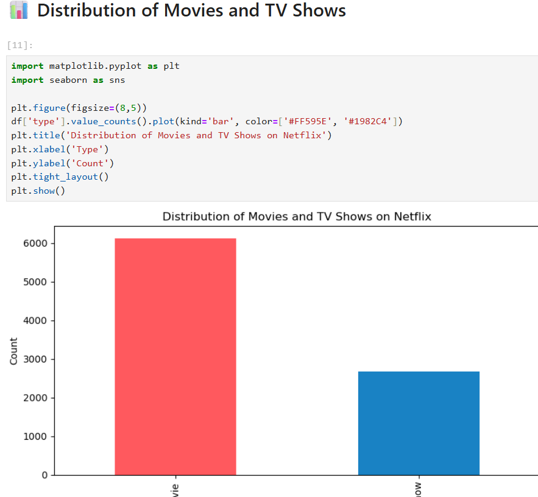
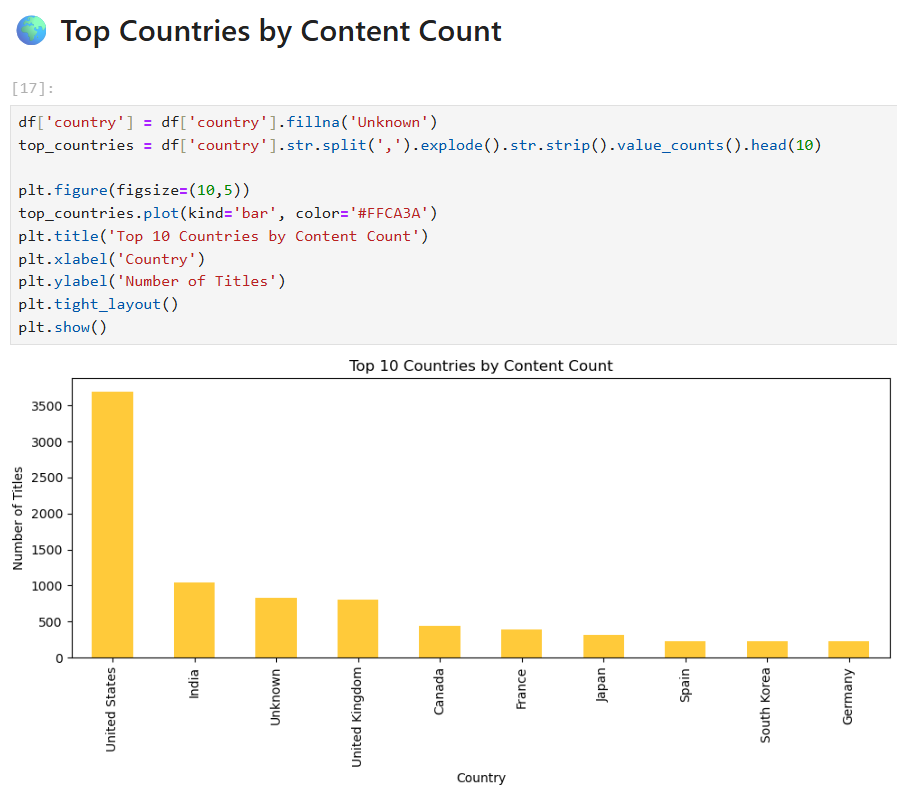
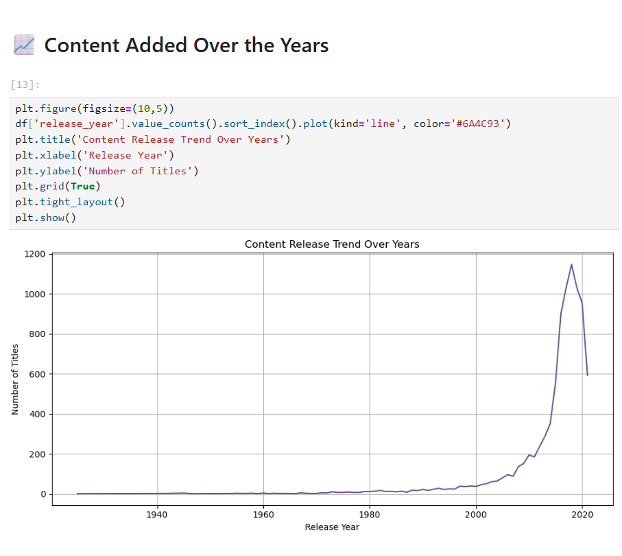

# 📺 Netflix Data Analysis Project

An exploratory data analysis (EDA) project on Netflix's publicly available content dataset sourced from Kaggle.  
This project uncovers insights about show types, country-wise trends, release years, and more using Python, Pandas, and Matplotlib.

---

## 📂 Dataset Information

- **Dataset:** [Netflix Titles Dataset – Kaggle](https://www.kaggle.com/datasets/shivamb/netflix-shows)
- **Creator:** Shivam Bansal (Kaggle)
- **Source:** Netflix public catalog snapshot
- **Columns include:** `title`, `type`, `director`, `cast`, `country`, `date_added`, `release_year`, `rating`, `duration`, `listed_in`, `description`

---

## 🔍 Key Questions Explored

- How many **movies vs. TV shows** are available on Netflix?
- What are the **trends in content added** over the years?
- Which are the **top countries** producing Netflix content?
- What are the **most common content ratings**?
- How has Netflix content **evolved over time**?

---

## 📁 Project Structure
netflix-data-analysis/
├── Netflix_Data_Analysis_Mariam.ipynb
├── netflix_titles.csv
├── movies-shows.png
├── country-count.png
└── common-ratings.png

---

## 🧪 Features & Techniques Used

- ✅ Data cleaning (nulls, formatting, whitespace)
- ✅ Feature engineering (`year_added`, `month_added`)
- ✅ Duplicate removal
- ✅ Date conversion & typecasting
- ✅ Visual analysis with **bar** and **line** charts
- ✅ Commented and structured Jupyter Notebook for clarity

---

## 📊 Sample Visualizations

### 🎬 Distribution of Movies and TV Shows  

### 🌍 Top Countries by Content Count  

### 🔢 Most Common Content Ratings  

---

## 🛠️ Tools & Technologies

- Python 3  
- Jupyter Notebook  
- Pandas  
- Matplotlib & Seaborn  
- CSV data wrangling & transformation

---

## 🚀 Future Enhancements

- 🎯 Add filtering by **genre**, **rating**, and **duration**
- 📊 Build an **interactive dashboard** using Dash or Streamlit
- 🎬 Apply **recommendation systems** (collaborative filtering)
- 🧑‍🤝‍🧑 Visualize actor/director networks using graphs

---

## 👩‍💻 Developed By

**Mariam Shariff**  
B.Sc. Computer Science & Mathematics 

---

> _This project is part of my Data Science portfolio using real-world datasets for learning and showcasing practical skills._
